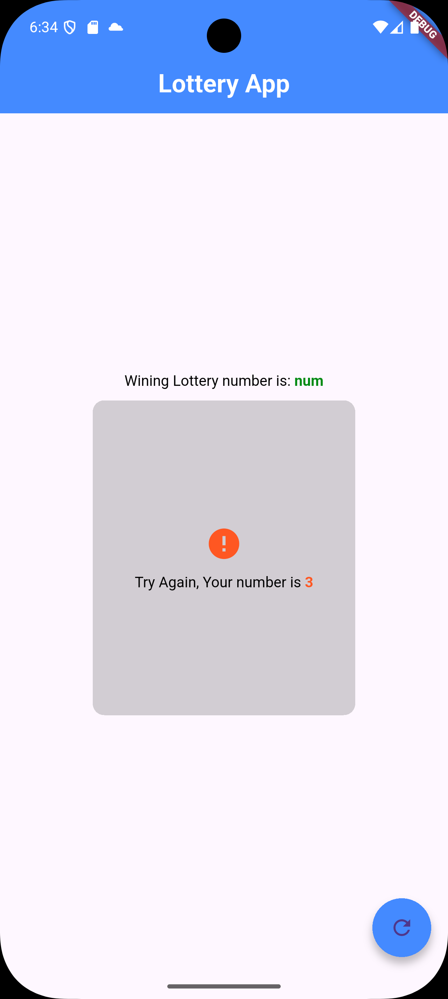

# 🎰 Simple Lottery App

A fun and interactive "Game of Chance" application built with **Flutter**. This app generates random numbers and compares them against a fixed winning number, demonstrating core concepts like state management, conditional rendering, and randomization in Dart.

---

### 📸 App Screenshots

| **Try Again (Loss)** | **Jackpot! (Win)** |
|:---:|:---:|
|  |  |
| *User rolled a random number (e.g., 9)* | *User rolled the winning number (5)!* |

---

### 🛠️ Tech Stack

*  **Flutter Framework**
*  **Dart Language**
* **Dart Math Library** (for Randomization)

---

### ✨ Key Features

* **Random Number Generation:** Generates a new random integer between 0-9 every time the refresh button is tapped.
* **Conditional UI:** The main container dynamically changes its **Color**, **Icon**, and **Size** based on whether the user wins or loses.
* **Interactive Feedback:** displays "Congratulations" for a win and "Better luck next time" for a loss.
* **Clean Architecture:** Modular code structure separating widgets (`widgets.dart`) from the main logic.

---

### 🚀 How to Run Locally

1.  **Clone the repository**
    ```bash
    git clone [https://github.com/saadullah-001/Lottery-App.git](https://github.com/saadullah-001/Lottery-App.git)
    ```

2.  **Navigate to the project directory**
    ```bash
    cd lottery-app
    ```

3.  **Install dependencies**
    ```bash
    flutter pub get
    ```

4.  **Run the app**
    ```bash
    flutter run
    ```

---

### 👤 Author

**Muhammad SaadUllah**
- [GitHub Profile](https://github.com/saadullah-001)
